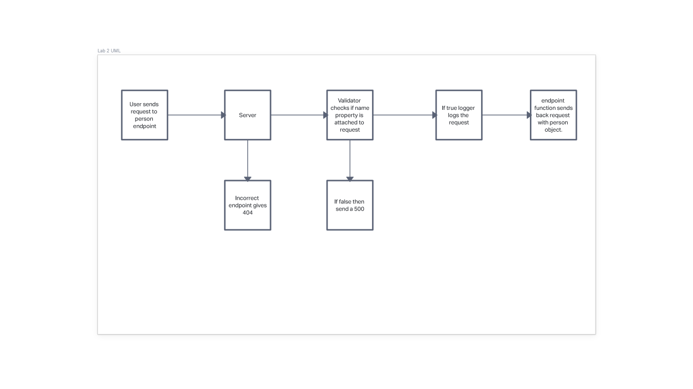

# basic-express-server 

## .env 

Requires your port.  

## running the app  

npm start or nodemon.  
/person endpoint with a name key value pair returns a json object.

## tests  

npm test runs all appropriate tests.

## UML  

## Tests folder  

Test folder has tests to ensure basic functionality of the server. These include a functioning endpoint, logger, validator, and error handling.  

## error -handlers  

404 and 500 error handlers give errors for not having a name property or using the wrong method.  

## middleware  

Logger console logs the method and name query. Validator ensures the request has the name property and if not throws an error.  

